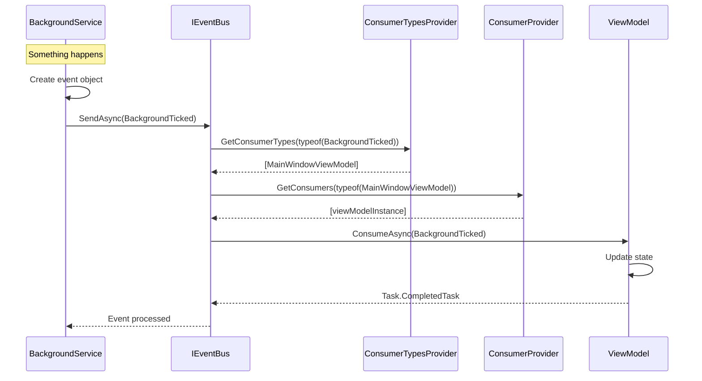
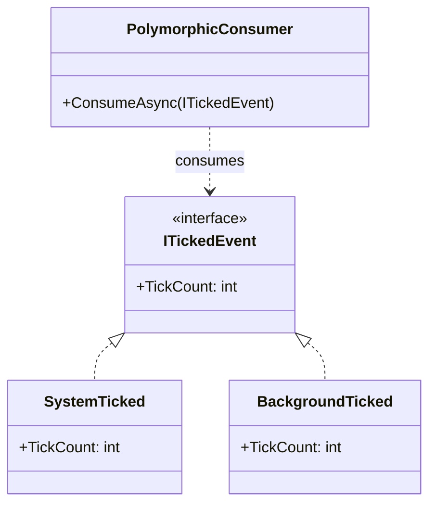

# Domain Events

## Overview

ReflectionEventing is built around the concept of domain events - messages that represent something that has happened in the application. This document describes how events work within the library.

## Event Contract

Events in ReflectionEventing are simple classes or records that carry data. There are no required base classes or interfaces for events themselves.

### Event Guidelines

| Guideline | Description |
|-----------|-------------|
| **Immutability** | Events should be immutable (use `record` or readonly properties) |
| **Naming** | Use past tense verbs (e.g., `OrderCreated`, `UserRegistered`) |
| **Data** | Include only relevant data, avoid including entire entities |
| **Serialization** | Design for potential serialization if needed |

### Example Events

```csharp
// Simple event with value
public record BackgroundTicked(int Value);

// Event with multiple properties
public record OrderCreated
{
    public Guid OrderId { get; init; }
    public string CustomerId { get; init; }
    public decimal TotalAmount { get; init; }
    public DateTime CreatedAt { get; init; }
}

// Event implementing an interface (for polymorphic handling)
public interface ITickedEvent
{
    int TickCount { get; }
}

public record SystemTicked(int TickCount) : ITickedEvent;
public record BackgroundTicked(int TickCount) : ITickedEvent;
```

## Event Flow



## Polymorphic Events

ReflectionEventing supports polymorphic event handling via `HashedPolymorphicConsumerTypesProvider`. This allows consumers to subscribe to base types or interfaces.



### Example

```csharp
// Consumer for any ITickedEvent
public class AnyTickEventConsumer : IConsumer<ITickedEvent>
{
    public Task ConsumeAsync(ITickedEvent payload, CancellationToken cancellationToken)
    {
        Console.WriteLine($"Received tick: {payload.TickCount}");
        return Task.CompletedTask;
    }
}

// This consumer will receive both SystemTicked and BackgroundTicked
```

## Event Lifecycle

### 1. Creation

Events are created by the publisher:

```csharp
var event = new BackgroundTicked(42);
```

### 2. Publishing

Events are sent through the event bus:

```csharp
// Immediate processing (waits for completion)
await eventBus.SendAsync(event);

// Queued processing (returns immediately)
await eventBus.PublishAsync(event);
```

### 3. Routing

The event bus finds all consumers for the event type:

```csharp
// Internal process
IEnumerable<Type> consumerTypes = typesProvider.GetConsumerTypes(typeof(BackgroundTicked));
```

### 4. Consumption

Each consumer processes the event:

```csharp
public class MyConsumer : IConsumer<BackgroundTicked>
{
    public Task ConsumeAsync(BackgroundTicked payload, CancellationToken cancellationToken)
    {
        // Handle the event
        return Task.CompletedTask;
    }
}
```

### 5. Completion

For `SendAsync`: Returns when all consumers complete.
For `PublishAsync`: Returns immediately; processing happens in background.

## Failed Events

When event processing fails, the failure is captured:

```csharp
public class FailedEvent
{
    public object Event { get; }
    public Exception Exception { get; }
    public DateTime FailedAt { get; }
}
```

## Best Practices

### Do

- ✅ Keep events small and focused
- ✅ Use immutable types (records)
- ✅ Include correlation IDs for tracing
- ✅ Use meaningful names in past tense
- ✅ Consider interface hierarchies for related events

### Don't

- ❌ Include behavior in events (events are data only)
- ❌ Include entire entities (only relevant data)
- ❌ Use events for request/response (use direct calls)
- ❌ Rely on event ordering (consumers may run in parallel)

## See Also

- [Domain Overview](../domain/overview.md)
- [Ubiquitous Language](../domain/ubiquitous-language.md)
- [ADR-001](../decisions/ADR-001-event-bus-pattern.md)

---

*Last updated: 2026-02-09*
