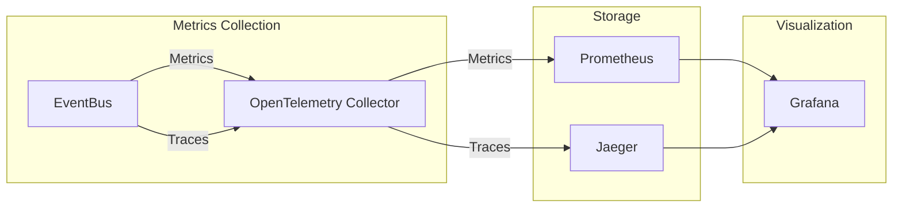

# Cross-Cutting Concerns: Observability

## Overview

ReflectionEventing includes built-in observability support using OpenTelemetry-compatible instrumentation for tracing and metrics.

## Tracing

The `EventBus` creates traces for event operations using `System.Diagnostics.ActivitySource`.

### Activity Source

```csharp
private static readonly ActivitySource ActivitySource = new("ReflectionEventing.EventBus");
```

### Trace Spans

| Operation | Activity Name | Tags |
|-----------|--------------|------|
| `SendAsync` | Producer activity | `co.lepo.reflection.eventing.message` = event type name |
| `PublishAsync` | Producer activity | `co.lepo.reflection.eventing.message` = event type name |

### Example Trace

```
TraceId: abc123...
├─ ReflectionEventing.EventBus (Producer)
│  └─ Tags: co.lepo.reflection.eventing.message = "BackgroundTicked"
```

### Integration with OpenTelemetry

```csharp
services.AddOpenTelemetry()
    .WithTracing(tracing =>
    {
        tracing.AddSource("ReflectionEventing.EventBus");
        // ... other sources
    });
```

## Metrics

The `EventBus` emits metrics using `System.Diagnostics.Metrics.Meter`.

### Meter

```csharp
private static readonly Meter Meter = new("ReflectionEventing.EventBus");
```

### Counters

| Counter | Name | Tags | Description |
|---------|------|------|-------------|
| Sent | `bus.sent` | `message_type` | Count of events sent via `SendAsync` |
| Published | `bus.published` | `message_type` | Count of events published via `PublishAsync` |

### Example Metrics Output

```
bus.sent{message_type="BackgroundTicked"} = 42
bus.sent{message_type="OrderCreated"} = 15
bus.published{message_type="AsyncEvent"} = 100
```

### Integration with OpenTelemetry

```csharp
services.AddOpenTelemetry()
    .WithMetrics(metrics =>
    {
        metrics.AddMeter("ReflectionEventing.EventBus");
        // ... other meters
    });
```

## Logging

The library doesn't include its own logging, but consumers can add logging:

```csharp
public class LoggingConsumer<TEvent> : IConsumer<TEvent>
{
    private readonly ILogger<LoggingConsumer<TEvent>> _logger;
    
    public async Task ConsumeAsync(TEvent payload, CancellationToken cancellationToken)
    {
        _logger.LogInformation("Processing event: {EventType}", typeof(TEvent).Name);
        // ... process event
    }
}
```

## Distributed Tracing

For distributed systems, correlation can be maintained through events:

```csharp
public record OrderCreated
{
    public Guid OrderId { get; init; }
    public string TraceId { get; init; } // For correlation
    public string SpanId { get; init; }
}

// Publishing
var activity = Activity.Current;
await eventBus.SendAsync(new OrderCreated
{
    OrderId = Guid.NewGuid(),
    TraceId = activity?.TraceId.ToString(),
    SpanId = activity?.SpanId.ToString()
});
```

## Monitoring Dashboard Example

### Key Metrics to Monitor

| Metric | Query | Alert Threshold |
|--------|-------|-----------------|
| Events sent/min | `rate(bus_sent_total[1m])` | Varies by app |
| Events published/min | `rate(bus_published_total[1m])` | Varies by app |
| Error rate | `rate(consumer_errors_total[1m])` | > 1% |

### Grafana Dashboard



## See Also

- [Logical Architecture](../views/logical-architecture.md) - Component overview
- [EventBus Implementation](../../src/ReflectionEventing/EventBus.cs) - Source code

---

*Last updated: 2026-02-09*
