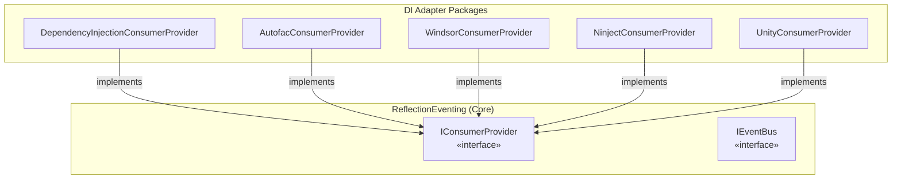

# ADR-002: Multi DI Container Support via Adapter Pattern

## Status

**Accepted**

## Date

2026-02-09

## Context

.NET ecosystem has multiple popular dependency injection containers:

- **Microsoft.Extensions.DependencyInjection** - Default for ASP.NET Core, modern .NET
- **Autofac** - Popular for advanced scenarios, WPF
- **Castle Windsor** - Enterprise, legacy systems
- **Ninject** - Lightweight, convention-based
- **Unity** - Microsoft patterns & practices

Different projects use different containers based on:
- Existing infrastructure
- Advanced features (decorators, modules, etc.)
- Team familiarity
- Legacy code constraints

ReflectionEventing needs to work with any of these containers without forcing users to switch.

## Decision

Implement the **Adapter Pattern** to support multiple DI containers:

1. **Core library is DI-agnostic** - No dependencies on any specific container
2. **Abstract interfaces** define contracts for DI operations
3. **Separate packages** for each container integration
4. **Consistent API** across all integrations

### Architecture

### Package Structure

| Package | Container | Extension Point |
|---------|-----------|-----------------|
| ReflectionEventing.DependencyInjection | Microsoft.Extensions.DI | `IServiceCollection.AddEventBus()` |
| ReflectionEventing.Autofac | Autofac | `ContainerBuilder.AddEventBus()` |
| ReflectionEventing.Castle.Windsor | Castle Windsor | `IWindsorContainer.Install()` |
| ReflectionEventing.Ninject | Ninject | `IKernel.Load()` |
| ReflectionEventing.Unity | Unity | `IUnityContainer.AddEventBus()` |

## Consequences

### Positive

- ✅ **Flexibility** - Works with any supported container
- ✅ **No lock-in** - Users can switch containers if needed
- ✅ **Minimal core** - Core library has no external DI dependencies
- ✅ **Familiar patterns** - Each adapter follows container conventions
- ✅ **Independent versioning** - Adapters can update separately

### Negative

- ⚠️ **Maintenance burden** - Multiple packages to maintain
- ⚠️ **Feature parity** - Must ensure consistent behavior across adapters
- ⚠️ **Testing overhead** - Need tests for each container integration
- ⚠️ **Documentation** - Need examples for each container

### Mitigations

- Comprehensive test suite for each adapter
- Shared test cases to verify behavior consistency
- Clear documentation with examples for each container

## Alternatives Considered

### 1. Support Only Microsoft.Extensions.DI

**Pros:** Simpler, one package, standard in modern .NET
**Cons:** Alienates users of other containers, especially in legacy/WPF

**Why rejected:** Significant user base uses alternative containers.

### 2. Use Abstractions Package Only

**Pros:** Single integration point
**Cons:** Not all containers implement Microsoft's abstractions

**Why rejected:** Autofac, Castle, Ninject have their own patterns.

### 3. Service Locator Pattern

**Pros:** Simpler integration
**Cons:** Anti-pattern, testability issues

**Why rejected:** Goes against modern DI best practices.

## Implementation Notes

Each adapter must implement:

1. **Consumer Provider** - Resolves consumers from the container
2. **Event Bus Builder** - Container-specific configuration
3. **Extension methods** - Idiomatic registration for the container
4. **Lifetime management** - Proper scoping of consumers

## Related Decisions

- [ADR-001](./ADR-001-event-bus-pattern.md) - Event Bus Pattern
- [ADR-004](./ADR-004-multi-targeting.md) - Multi-targeting

---

*Last updated: 2026-02-09*
