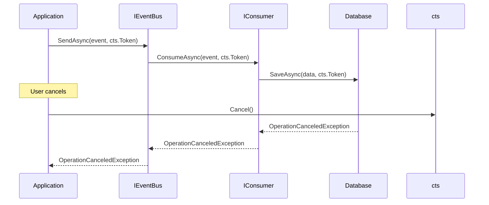

# ADR-003: Async-First Design for All Operations

## Status

**Accepted**

## Date

2026-02-09

## Context

Modern .NET applications heavily rely on asynchronous programming for:

- I/O-bound operations (database, HTTP, file system)
- UI responsiveness (WPF, WinForms)
- Scalability (ASP.NET Core request handling)
- Long-running operations

Event consumers often perform these async operations, making async support essential.

## Decision

Design all public APIs as **async-first**:

1. **All event bus methods return `Task`**
2. **Consumer interface uses `ConsumeAsync`**
3. **CancellationToken support throughout**
4. **No synchronous alternatives provided**

### API Design

```csharp
public interface IEventBus
{
    Task SendAsync<TEvent>(TEvent eventItem, CancellationToken cancellationToken = default)
        where TEvent : class;
        
    Task PublishAsync<TEvent>(TEvent eventItem, CancellationToken cancellationToken = default)
        where TEvent : class;
}

public interface IConsumer<in TEvent>
{
    Task ConsumeAsync(TEvent payload, CancellationToken cancellationToken);
}
```

### CancellationToken Flow



## Consequences

### Positive

- ✅ **Scalability** - Async operations don't block threads
- ✅ **UI responsiveness** - Non-blocking for WPF/WinForms
- ✅ **Cancellation support** - Operations can be cancelled gracefully
- ✅ **Modern .NET alignment** - Follows current best practices
- ✅ **Composability** - Easy to chain async operations

### Negative

- ⚠️ **Complexity** - Async code requires understanding of Task/async/await
- ⚠️ **Debugging** - Async stack traces can be harder to follow
- ⚠️ **Overhead** - Small overhead for truly synchronous consumers

### Mitigations

- Provide clear documentation on async patterns
- Use `ConfigureAwait(false)` where appropriate
- Consider `ValueTask` for hot paths in future versions

## Implementation Details

### EventBus Implementation

```csharp
public virtual async Task SendAsync<TEvent>(
    TEvent eventItem,
    CancellationToken cancellationToken = default)
    where TEvent : class
{
    // Create tasks for all consumers
    List<Task> tasks = [];
    
    foreach (Type consumerType in consumerTypesProvider.GetConsumerTypes(typeof(TEvent)))
    {
        foreach (var consumer in consumerProvider.GetConsumers(consumerType))
        {
            tasks.Add(((IConsumer<TEvent>)consumer).ConsumeAsync(eventItem, cancellationToken));
        }
    }
    
    // Execute all consumers in parallel
    await Task.WhenAll(tasks).ConfigureAwait(false);
}
```

### Queue-Based Processing

```csharp
public virtual async Task PublishAsync<TEvent>(
    TEvent eventItem,
    CancellationToken cancellationToken = default)
    where TEvent : class
{
    // Non-blocking enqueue
    await queue.EnqueueAsync(eventItem, cancellationToken);
}
```

## Alternatives Considered

### 1. Dual API (Sync + Async)

**Pros:** Flexibility for simple scenarios
**Cons:** Maintenance overhead, sync-over-async anti-pattern

**Why rejected:** Encourages anti-patterns, doubles API surface.

### 2. Sync-First with Async Extensions

**Pros:** Simpler for sync-only consumers
**Cons:** Blocks threads, poor scalability

**Why rejected:** Doesn't align with modern .NET practices.

### 3. ValueTask Instead of Task

**Pros:** Less allocation for sync completion
**Cons:** More complex, easier to misuse

**Why rejected:** Premature optimization; can be added later if needed.

## Related Decisions

- [ADR-001](./ADR-001-event-bus-pattern.md) - Event Bus Pattern

---

*Last updated: 2026-02-09*
