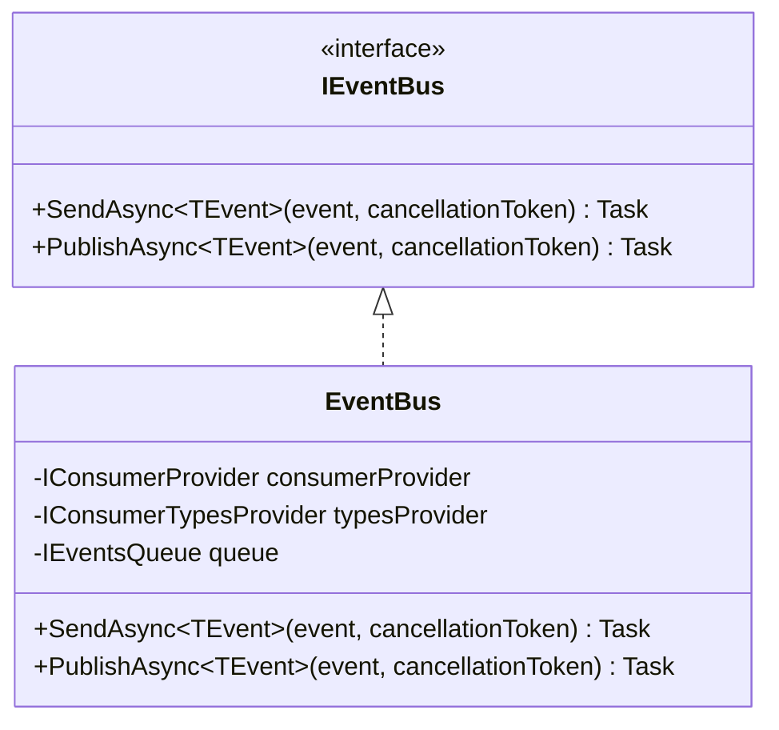
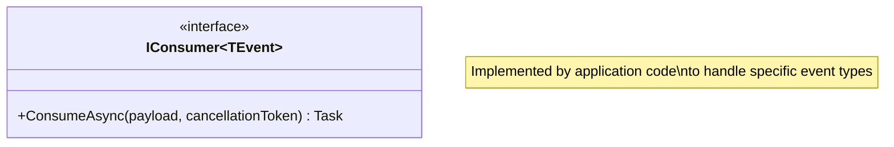
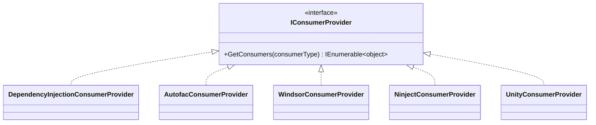
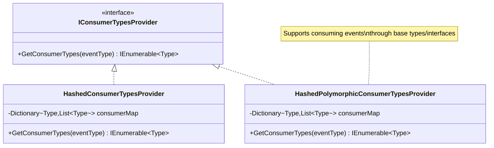
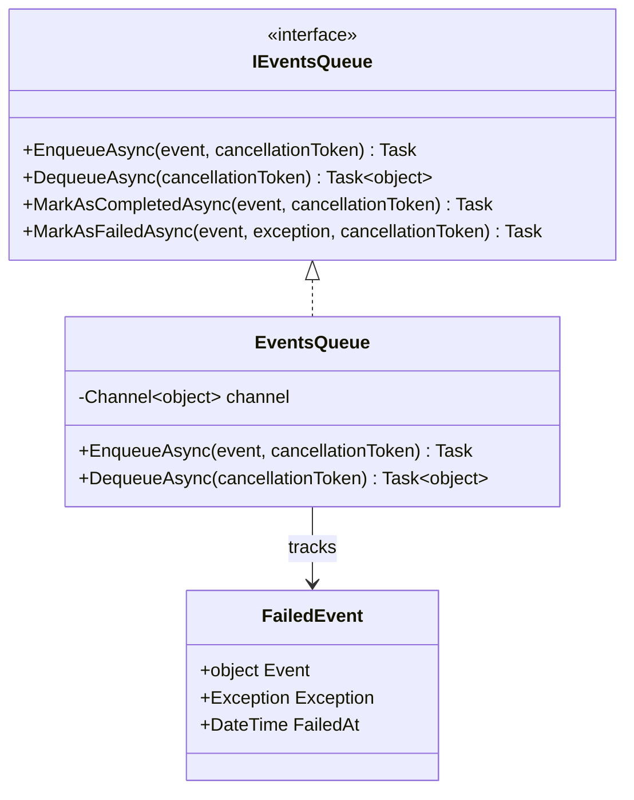
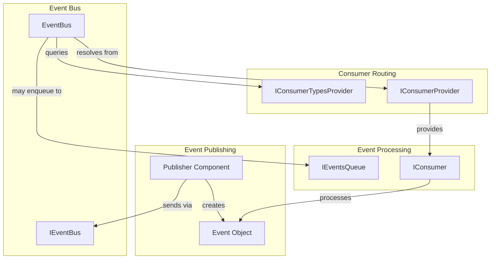

# Domain Overview

## Introduction

ReflectionEventing is a library, not a business application, so its "domain" consists of the patterns and concepts related to event-driven architecture and dependency injection.

## Core Domain Concepts

### Event Bus

The central component that enables decoupled communication between parts of an application through events.

### Consumer

A component that handles a specific type of event.

### Consumer Provider

Abstracts the dependency injection container for resolving consumer instances.

### Consumer Types Provider

Maps event types to their registered consumer types.

### Events Queue

A queue for asynchronous event processing.

## Domain Relationships

## Processing Modes

The library supports different processing modes for events:

| Mode | Method | Behavior |
|------|--------|----------|
| **Immediate** | `SendAsync` | Event is processed immediately in the current scope, blocking until all consumers complete |
| **Queued** | `PublishAsync` | Event is added to a queue for background processing, returns immediately |

## Key Design Decisions

1. **Interface-based design**: All core components are defined as interfaces, allowing for multiple implementations and easy testing.

2. **Generic events**: Events are typed using generics (`TEvent`), allowing compile-time type safety.

3. **Async-first**: All operations are asynchronous, supporting modern async/await patterns.

4. **DI-agnostic core**: The core library has no dependency on any specific DI container.

5. **Parallel processing**: Multiple consumers can process the same event in parallel.

## See Also

- [Ubiquitous Language](./ubiquitous-language.md) - Terminology definitions
- [Logical Architecture](../views/logical-architecture.md) - Component details
- [ADR-001](../decisions/ADR-001-event-bus-pattern.md) - Event Bus Pattern decision

---

*Last updated: 2026-02-09*
