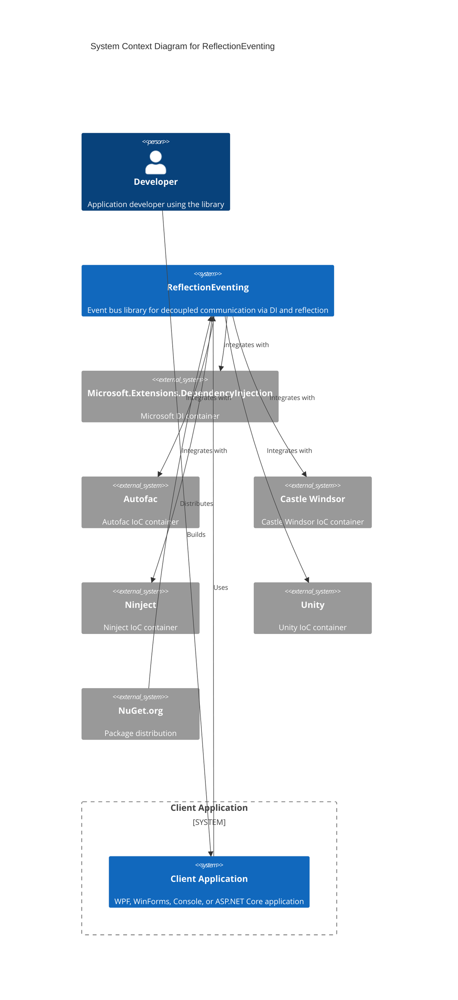
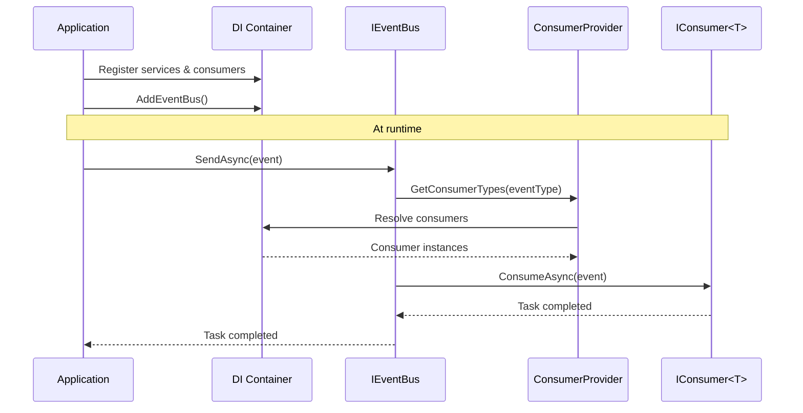

# System Context View

> C4 Model - Level 1: System Context Diagram

## Overview

This view shows the ReflectionEventing library in the context of its environment, including the applications that use it and the DI containers it integrates with.

## Context Diagram

## System Description

| Element | Type | Description |
|---------|------|-------------|
| ReflectionEventing | Library | Core event bus library enabling decoupled pub/sub communication |
| Client Application | System | Any .NET application consuming the library |
| DI Containers | External Systems | IoC containers for dependency resolution |
| NuGet.org | Distribution | Package hosting and distribution |

## Users and Actors

| Actor | Description | Interactions |
|-------|-------------|--------------|
| Developer | Application developer | Integrates library, registers consumers, publishes events |
| Consumer | Event handler component | Receives and processes events |
| Publisher | Event source component | Creates and publishes events |

## Integration Points

### Supported DI Containers

| Container | Package | Minimum Version |
|-----------|---------|-----------------|
| Microsoft.Extensions.DependencyInjection | ReflectionEventing.DependencyInjection | 3.1.0+ |
| Autofac | ReflectionEventing.Autofac | 4.0.0+ |
| Castle Windsor | ReflectionEventing.Castle.Windsor | 6.0.0+ |
| Ninject | ReflectionEventing.Ninject | 3.0.1+ |
| Unity | ReflectionEventing.Unity | 5.11.0+ |

### Target Frameworks

| Framework | Support Level |
|-----------|--------------|
| .NET 9.0 | Full (AOT enabled) |
| .NET 8.0 | Full (AOT enabled) |
| .NET 6.0 | Full |
| .NET Standard 2.0 | Full |
| .NET Framework 4.6.2 | Full |
| .NET Framework 4.7.2 | Full |

## System Boundaries

### What's Inside the Boundary

- Event bus core implementation
- Consumer discovery and registration
- Event routing and dispatching
- Queue-based async event processing
- DI container adapters
- Observability (OpenTelemetry metrics and traces)

### What's Outside the Boundary

- DI container implementations (provided by external libraries)
- Application-specific event types
- Consumer implementations
- Application hosting and lifecycle

## Usage Pattern

## Quality Attributes

| Attribute | Requirement | How Addressed |
|-----------|-------------|---------------|
| Availability | High (library shouldn't crash host) | Exception handling, CancellationToken support |
| Scalability | Handle many events efficiently | Parallel processing, Channel-based queuing |
| Performance | Low latency event dispatch | Hashed consumer lookup (O(1)), async/await |
| Extensibility | Support multiple DI containers | Adapter pattern, interface-based design |
| Testability | Easy to mock and test | Interface-based design, NSubstitute support |

## See Also

- [Logical Architecture](./logical-architecture.md) - Component details
- [Domain Overview](../domain/overview.md) - Core concepts
- [ADR-001](../decisions/ADR-001-event-bus-pattern.md) - Event Bus Pattern decision

---

*Last updated: 2026-02-09*
