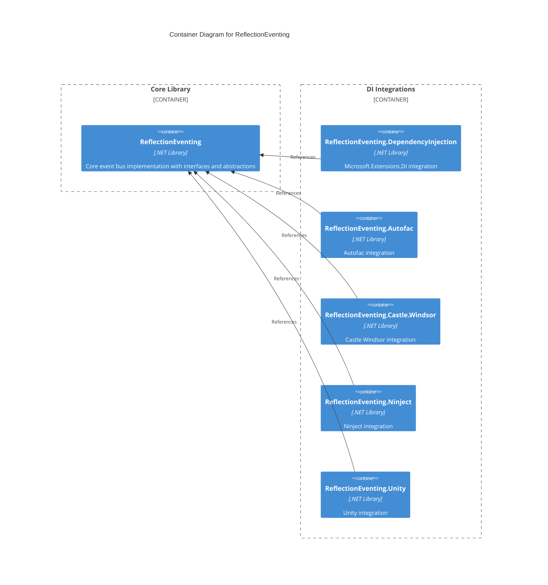
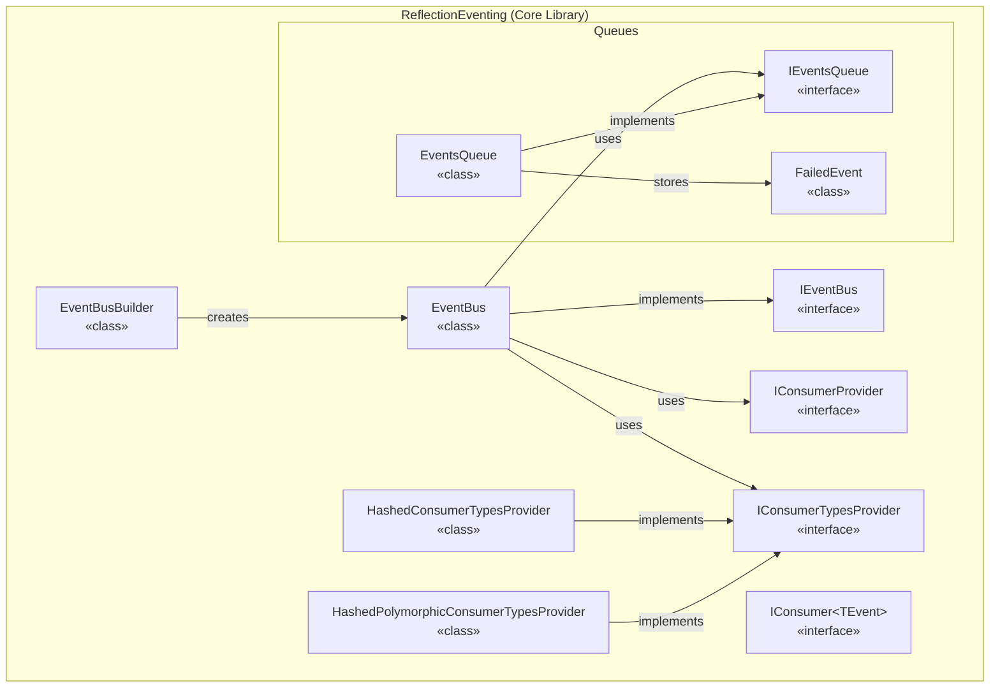
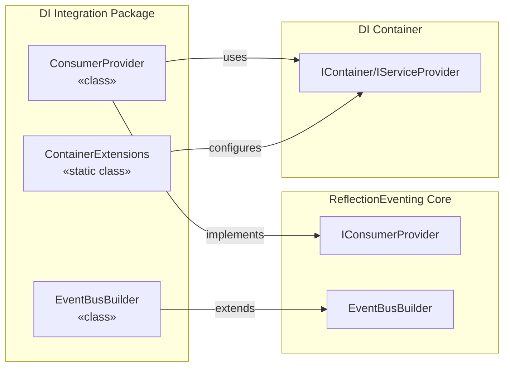
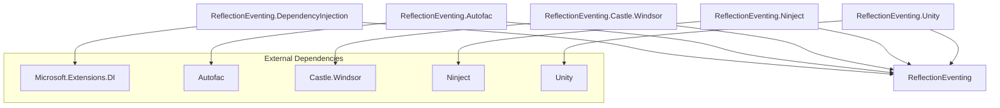
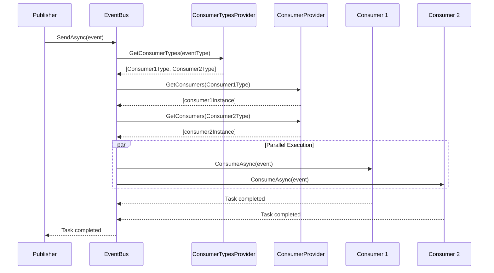
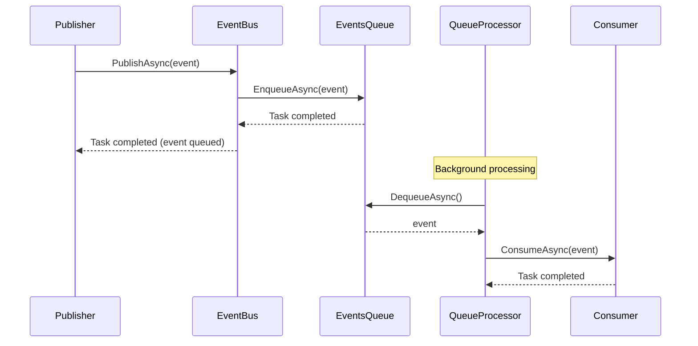

# Logical Architecture View

> C4 Model - Level 2: Container Diagram & Level 3: Component Diagram

## Overview

This view presents the logical architecture of ReflectionEventing, showing the main modules (packages) and their components.

## Container Diagram (C4 Level 2)



## Module Overview

| Module | Technology | Purpose | Responsibility |
|--------|------------|---------|----------------|
| ReflectionEventing | .NET Standard 2.0+ | Core library | Event bus abstraction, interfaces, base implementation |
| ReflectionEventing.DependencyInjection | .NET Standard 2.0+ | MS DI adapter | Integration with Microsoft.Extensions.DependencyInjection |
| ReflectionEventing.Autofac | .NET Standard 2.0+ | Autofac adapter | Integration with Autofac IoC container |
| ReflectionEventing.Castle.Windsor | .NET Standard 2.0+ | Castle adapter | Integration with Castle Windsor container |
| ReflectionEventing.Ninject | .NET Standard 2.0+ | Ninject adapter | Integration with Ninject container |
| ReflectionEventing.Unity | .NET Standard 2.0+ | Unity adapter | Integration with Unity container |

## Core Component Diagram (C4 Level 3)



## Component Responsibilities

| Component | Responsibility | Dependencies |
|-----------|----------------|--------------|
| `IEventBus` | Contract for event publishing | None |
| `EventBus` | Routes events to consumers | IConsumerProvider, IConsumerTypesProvider, IEventsQueue |
| `IConsumer<TEvent>` | Contract for event consumption | None |
| `IConsumerProvider` | Resolves consumer instances from DI | None |
| `IConsumerTypesProvider` | Maps event types to consumer types | None |
| `HashedConsumerTypesProvider` | O(1) lookup for consumer types | None |
| `HashedPolymorphicConsumerTypesProvider` | Supports polymorphic event handling | None |
| `EventBusBuilder` | Fluent API for configuration | All above |
| `IEventsQueue` | Contract for event queuing | None |
| `EventsQueue` | Channel-based event queue | System.Threading.Channels |
| `FailedEvent` | Tracks failed event processing | None |

## DI Integration Pattern

Each DI integration package follows the same pattern:



## Module Structure

```
ReflectionEventing/
├── src/
│   ├── ReflectionEventing/
│   │   ├── IEventBus.cs
│   │   ├── EventBus.cs
│   │   ├── IConsumer.cs
│   │   ├── IConsumerProvider.cs
│   │   ├── IConsumerTypesProvider.cs
│   │   ├── HashedConsumerTypesProvider.cs
│   │   ├── HashedPolymorphicConsumerTypesProvider.cs
│   │   ├── EventBusBuilder.cs
│   │   ├── EventBusBuilderOptions.cs
│   │   ├── EventBusException.cs
│   │   ├── ProcessingMode.cs
│   │   └── Queues/
│   │       ├── IEventsQueue.cs
│   │       ├── EventsQueue.cs
│   │       ├── FailedEvent.cs
│   │       └── QueueException.cs
│   │
│   ├── ReflectionEventing.DependencyInjection/
│   │   ├── DependencyInjectionConsumerProvider.cs
│   │   ├── DependencyInjectionEventBus.cs
│   │   ├── DependencyInjectionEventBusBuilder.cs
│   │   ├── ServiceCollectionExtensions.cs
│   │   ├── EventBusBuilderExtensions.cs
│   │   └── Configuration/
│   │       └── QueueProcessorOptionsProvider.cs
│   │
│   ├── ReflectionEventing.Autofac/
│   │   ├── AutofacConsumerProvider.cs
│   │   ├── AutofacEventBusBuilder.cs
│   │   └── ContainerBuilderExtensions.cs
│   │
│   ├── ReflectionEventing.Castle.Windsor/
│   │   ├── WindsorConsumerProvider.cs
│   │   ├── WindsorEventBusBuilder.cs
│   │   └── EventBusInstaller.cs
│   │
│   ├── ReflectionEventing.Ninject/
│   │   ├── NinjectConsumerProvider.cs
│   │   ├── NinjectEventBusBuilder.cs
│   │   └── EventBusModule.cs
│   │
│   └── ReflectionEventing.Unity/
│       ├── UnityConsumerProvider.cs
│       ├── UnityEventBusBuilder.cs
│       └── UnityContainerExtensions.cs
│
└── tests/
    ├── ReflectionEventing.UnitTests/
    ├── ReflectionEventing.DependencyInjection.UnitTests/
    ├── ReflectionEventing.Autofac.UnitTests/
    ├── ReflectionEventing.Castle.Windsor.UnitTests/
    ├── ReflectionEventing.Ninject.UnitTests/
    └── ReflectionEventing.Unity.UnitTests/
```

## Module Dependencies



## Communication Patterns

### Event Flow - SendAsync (Synchronous)



### Event Flow - PublishAsync (Queued)



## Technology Stack

### Runtime

| Component | Technology | Version |
|-----------|------------|---------|
| Runtime | .NET 9/8/6/Standard 2.0/FX 4.6.2+ | Multiple |
| Language | C# | 13.0 |
| Async | System.Threading.Channels | 9.0.0 |
| Observability | System.Diagnostics.DiagnosticSource | 6.0.0 |

### Development

| Tool | Purpose |
|------|---------|
| xUnit | Unit testing |
| NSubstitute | Mocking |
| AwesomeAssertions | Fluent assertions |
| StyleCop | Code style enforcement |
| PolySharp | Polyfills for older frameworks |

## See Also

- [Context View](./context.md) - System context
- [Domain Model](../domain/overview.md) - Business domain
- [ADR-002](../decisions/ADR-002-multi-di-container-support.md) - Multi DI Container decision

---

*Last updated: 2026-02-09*
